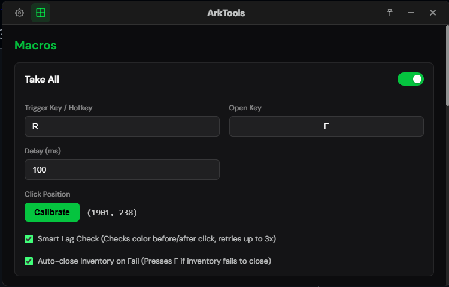
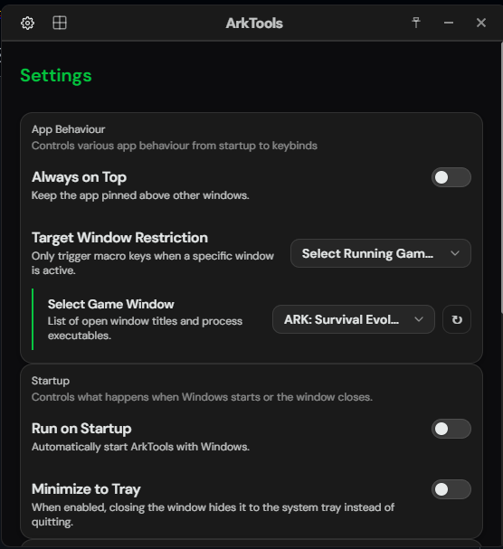

  

    
    
    
    
  

  # ArkTools

  
<em>An extensible premade macro launcher and utility suite for ARK: Survival Evolved and Survival Ascended.</em>

  

    
    
  

  ---

  <a href="#features">Features</a> ·
  <a href="#quick-start">Quick Start</a> ·
  <a href="#building-from-source">Building from Source</a> ·
  <a href="#license">License</a>

---

**ArkTools** is a modern, lightweight utility application designed to automate common repetitive tasks in ARK: Survival Evolved and Survival Ascended. Built with Tauri v2, React, and Rust, it provides maximum performance with an extremely small resource footprint.

---

## Features

### Macro Actions
*   **Take All**: Press your interaction key, wait for the inventory container UI to open, and trigger a "Take All" button press automatically. Includes customization for opening delays and smart inventory handling.
*   **Auto Walk**: Automatically holds down your move key (W) to walk long distances without finger strain. Supports toggling auto-sprint.
*   **Auto Tek Legs**: Automates the Tek Leg charging/sprinting action (holding Ctrl).
*   **Hold E**: Holds down the interaction key (E) continuously for collection and interaction tasks.
*   **Anti AFK**: Periodically performs minor movements to prevent getting disconnected from servers due to inactivity.

### Advanced Settings
*   **Target Window Restriction**: Restrict hotkeys to trigger only when the official ARK game process or a custom window title is active, preventing accidental triggers on your desktop or other apps.
*   **System Tray Integration**: Option to minimize to the system tray, running quietly in the background without cluttering your taskbar.
*   **Autostart**: Automatically launch ArkTools on Windows startup so it is always ready when you play.
*   **Custom Accent Themes**: Sleek user interface featuring a gorgeous dark mode, light mode, and customized accent theme colors.
*   **Software Updates**: Built-in automatic update checker and downloader targeting the secure updates API.

---

## Quick Start

1.  Download the latest installer from the [Releases](https://github.com/Fayberr/ArkTools/releases) page.
2.  Run the NSIS installer to install ArkTools.
3.  Launch the app, configure your hotkeys for the desired macros under the **Macros** panel, and configure game restrictions or autostart under **Settings**.

*Config files and local states are saved securely under `%appdata%/ArkTools`.*

---

## Building from Source

If you wish to compile ArkTools yourself, refer to [BUILDING.md](BUILDING.md) for environment configuration, development servers, and production build guides.

---

## License

Licensed under the [GNU General Public License](LICENSE).
